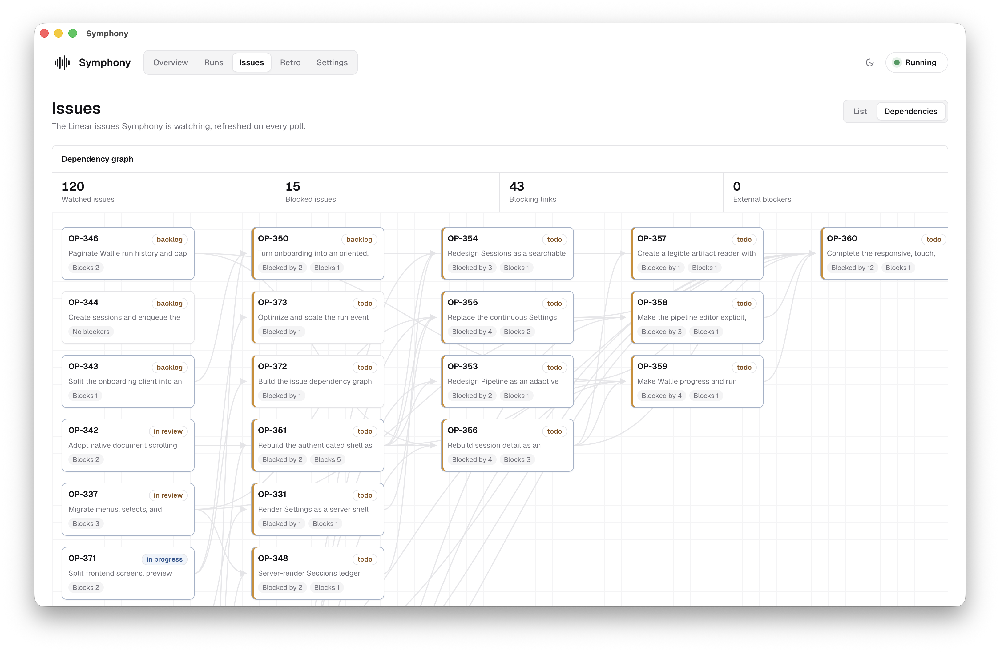

# Symphony

**Un equipo de ingeniería autónomo para tu proyecto de Linear.** Symphony es una aplicación de escritorio que monitorea tu tablero de Linear y despacha agentes de código — [Codex](https://github.com/openai/codex), [Claude Code](https://claude.com/claude-code), [Cursor](https://cursor.com/docs/cli/overview) u [opencode](https://opencode.ai) — para trabajar en incidencias, cada uno en su propio espacio de trabajo clonado recién creado. Tú triajas y revisas; Symphony orquesta. Basado en la [especificación](https://github.com/openai/symphony/blob/main/SPEC.md) de OpenAI.

**[⬇ Descargar para macOS](https://github.com/anantjain-xyz/symphony-rust/releases/latest/download/Symphony.dmg)** (Apple Silicon) · [](https://github.com/anantjain-xyz/symphony-rust/releases/latest)

<picture>
  <source media="(prefers-color-scheme: dark)" srcset="docs/overview-dark.png">
  
</picture>

### Grafo de dependencias



## Cómo funciona

1. **Sondeo** — un trabajador local sondea Linear en busca de incidencias en los estados que marques como activos (p. ej., `Todo`, `In Progress`, `Rework`).
2. **Preparación** — para cada incidencia, Symphony crea un espacio de trabajo aislado y ejecuta tu gancho `after_create` (típicamente `git clone` + instalación de dependencias).
3. **Despacho** — resuelve el flujo de trabajo del repositorio asignado (o el predeterminado guardado), lo renderiza con el identificador, título, estado y descripción de la incidencia, y luego impulsa una sesión de agente de Codex, Claude Code, Cursor u opencode de forma nativa sobre sus flujos de eventos estructurados.
4. **Seguimiento** — los eventos del agente, el conteo de tokens, reintentos, fallos y señales de límite de tasa del proveedor se registran en una base de datos SQLite local y se transmiten en vivo al panel de control.
5. **Reintento** — las ejecuciones fallidas se reintentan con retroceso exponencial, y el prompt de reintento incluye el contexto de error de la ejecución anterior.

Todo se ejecuta en tu máquina. Las llamadas de red van a la API de Linear, las herramientas que usan tus agentes y ganchos, y — en las compilaciones empaquetadas — a GitHub Releases para una verificación ligera de actualizaciones al iniciar y cada seis horas. Los paquetes de actualización se descargan solo después de que hagas clic en **Actualizar**.

## Retros

La vista **Retro** convierte los fallos repetidos de ejecución y la confusión en el panel de trabajo en mejoras de flujo de trabajo revisables. Cada retro generado cubre las ejecuciones terminales desde la última retro completada y agrupa sus hallazgos por repositorio.

Las nuevas retros preparan un diff exacto para cada cambio de prompt o habilidad sugerido. Revisa cada propuesta con **Aceptar** o **Rechazar**; los cambios aceptados permanecen locales hasta que la revisión se complete. Luego, Symphony ofrece las acciones aplicables:

- **Aplicar flujo de trabajo predeterminado** actualiza el flujo de trabajo validado almacenado en Configuración y reconfigura en caliente al trabajador cuando es posible.
- **Crear PRs de implementación** agrupa los cambios aceptados de flujo de trabajo del repositorio y habilidades en un pull request por repositorio. Cada PR usa una rama determinista `symphony/retro-*` y contiene solo los archivos objetivo revisados.

Las propuestas registran el hash del flujo de trabajo o la revisión del repositorio desde el que se generaron. Si el prompt, la rama predeterminada o el archivo objetivo cambian antes de la ejecución, Symphony marca el lote como obsoleto en lugar de aplicar una fusión no vista. El progreso de los PR y los enlaces exitosos se retienen por repositorio, por lo que un fallo en un repositorio no oculta PRs exitosos para otro. Las retros creadas antes de que se introdujeran los diffs revisables permanecen disponibles como informes históricos de solo lectura.

## Requisitos

- **macOS** (objetivo principal; las compilaciones de Tauri para otras plataformas no se han probado)
- Un espacio de trabajo de [Linear](https://linear.app) y una [clave API personal](https://linear.app/settings/account/security)
- Al menos un CLI de agente instalado y autenticado:
  - `codex` — OpenAI Codex CLI
  - `claude` — Claude Code CLI
  - `agent` — CLI del Agente de Cursor (`cursor-agent` también funciona)
  - `opencode` — opencode CLI
- `git`, además de lo que necesite el paso de instalación de tu repositorio

## Primeros pasos

**[Descargar Symphony.dmg](https://github.com/anantjain-xyz/symphony-rust/releases/latest/download/Symphony.dmg)** — la última compilación firmada y notariada para macOS (Apple Silicon). Ábrelo, arrastra **Symphony** a Aplicaciones y ejecútalo.

O compila y ejecuta desde el código fuente:

```sh
git clone https://github.com/anantjain-xyz/symphony-rust.git
cd symphony-rust
pnpm install
pnpm tauri dev      # o: pnpm tauri build
```

Consulta [Compilación](#building) para paquetes de producción y versiones firmadas.

Al primer lanzamiento, la Vista General muestra una lista de verificación de configuración:

1. **Conectar Linear** — pega tu clave API en *Configuración → Linear*. Se almacena en el llavero de macOS, nunca en el disco.
2. **Añadir tus repositorios** — una o más URLs de Git; cada ejecución clona el repositorio al que se enruta su incidencia.
3. **Iniciar el trabajador** — el botón ▶ en la barra superior. Symphony comienza a sondear y despachar.

Las listas de filtros opcionales de equipo y proyecto de Linear estrechan las incidencias que Symphony recoge. Los valores dentro de una lista se combinan con OR; cuando se establecen ambas listas, una incidencia debe coincidir con al menos un equipo y al menos un proyecto. Usa **Validar** en Configuración para comprobar tu configuración y confirmar que los CLIs de los agentes son detectables antes de iniciar.

## Configuración y flujos de trabajo

El comportamiento operativo de Symphony se configura en *Configuración*:

- **Repositorios** — los repositorios de Git que clonan las ejecuciones, cada uno con su propio comando de instalación, más dónde se crean los espacios de trabajo por ejecución (una carpeta por repositorio, luego por incidencia). Cada incidencia se enruta exactamente a un repositorio: una etiqueta `repo:<nombre>` o una etiqueta simple `<nombre>` en la incidencia en Linear tiene prioridad, luego Symphony usa el repositorio marcado como *predeterminado*. El predeterminado es opcional; sin una etiqueta coincidente o un predeterminado, la incidencia se omite. Una incidencia cuya etiqueta `repo:` no coincide con ningún repositorio configurado se omite: una etiqueta explícita nunca se redirige silenciosamente. Cada ejecución registra el repositorio al que se despachó; con varios repositorios configurados, el panel etiqueta las ejecuciones con él y la vista Ejecuciones puede filtrar por repositorio.
- **Linear** — clave API (llavero), espacio de trabajo opcional más listas de filtros de proyecto/equipo separadas por comas, y los estados de flujo de trabajo que impulsan el despacho. Cada lista coincide con cualquier valor configurado; cuando ambas no están vacías, deben coincidir ambas dimensiones. Las incidencias en un *estado activo* (p. ej., `Todo`, `In Progress`, `Rework`, `Merging`) obtienen un agente; las incidencias en un *estado terminal* (p. ej., `Done`, `Canceled`) se dejan como están.
- **Agente** — qué CLI ejecuta las incidencias (`codex`, `claude`, `cursor` u `opencode`), un comando de lanzamiento opcional (envoltorios con argumentos como `mycode --agent claude` están bien; Symphony añade sus propias banderas), el tiempo de espera por turno, variables de entorno de sesión personalizadas (p. ej., `CURSOR_API_KEY` para Cursor), y las opciones del backend: modo de permiso, sandbox de subprocesos y acceso a red para Codex; modo de permiso y reglas de herramientas permitidas/no permitidas para Claude Code; modo, force/trust (fuerza/confianza), sandbox y modelo opcional para Cursor; modelo y agente opcionales más un interruptor para omitir permisos para opencode (activado por defecto: opencode rechaza automáticamente cada llamada de herramienta en modo no interactivo sin él).
- **Trabajador** — intervalo de sondeo, máximo de agentes concurrentes, límite de retroceso de reintento y los ganchos del ciclo de vida (bajo *Ganchos (avanzado)*): `after_create`, `before_run`, `after_run`, `before_remove`. Los ganchos son scripts de shell que se ejecutan en el espacio de trabajo con `$REPO_URL`, `$REPO_NAME`, `$ISSUE_ID`, `$ISSUE_IDENTIFIER`, `$ISSUE_TITLE`, `$ISSUE_STATE`, `$ISSUE_BRANCH`, `$RUN_NUMBER`, `$SYMPHONY_INSTALL_CMD` y `$SYMPHONY_HOOK` en su entorno; las variables del repositorio reflejan el repositorio al que se enrutó la incidencia. Los grupos de procesos del gancho se limpian después de que el gancho devuelve, por lo que un gancho no debe dejar servicios en segundo plano para una fase posterior del ciclo de vida.

El **flujo de trabajo predeterminado** en la parte inferior de Configuración es el documento de instrucciones enviado al agente para cada incidencia. Un repositorio puede anular esas instrucciones haciendo commit de un archivo UTF-8 regular llamado `SYMPHONY-WORKFLOW.md` o `symphony-workflow.md` en su raíz. El nombre en mayúsculas tiene prioridad si existen ambos. Los archivos vacíos, marcadores de posición no compatibles, enlaces simbólicos y otros archivos no válidos retroceden al flujo de trabajo predeterminado guardado.

Para cada despacho, Symphony obtiene la última rama predeterminada del repositorio sin hacer checkout sobre la rama de la incidencia. Se utiliza un flujo de trabajo del repositorio válido de esa rama; si la actualización falla, Symphony intenta su copia en caché de la rama predeterminada antes de retroceder al predeterminado guardado. Las tarjetas de repositorio en Configuración muestran la fuente detectada. Cuando el predeterminado está activo, los repositorios de GitHub.com y GitHub Enterprise compatibles pueden crear un PR `symphony/install-workflow` que copia el predeterminado guardado en el `SYMPHONY-WORKFLOW.md` canónico.

Los archivos de flujo de trabajo del repositorio reemplazan solo el documento de instrucciones del agente. La configuración del rastreador, los ganchos del ciclo de vida, el backend y permisos del agente, la ubicación del espacio de trabajo, el sondeo y la concurrencia permanecen controlados por Configuración.

Los marcadores de posición en formato `{{...}}` se renderizan desde la incidencia de Linear cuando comienza una ejecución; el panel de referencia junto al editor del flujo de trabajo predeterminado los enumera e inserta uno en el cursor al hacer clic:

| Marcador de posición | Se renderiza como |
|---|---|
| `{{issue.id}}` | ID interno de Linear |
| `{{issue.identifier}}` | Clave de incidencia, p. ej., `SYM-42` |
| `{{issue.title}}` | Título de la incidencia |
| `{{issue.description}}` | Cuerpo completo de la incidencia (vacío si no hay) |
| `{{issue.state}}` | Estado actual de Linear |
| `{{issue.branch}}` | Rama de Git desde Linear (puede estar vacía) |
| `{{issue.labels}}` | Etiquetas, separadas por comas |
| `{{issue.blockers}}` | Identificadores de incidencias bloqueantes, un punto `- <id>` por línea |
| `{{repo.name}}` | Nombre del repositorio al que se enrutó la incidencia |
| `{{repo.url}}` | URL de Git del repositorio enrutado |

Las ejecuciones reintentadas obtienen automáticamente una sección `## Contexto de reintento` agregada con el error de la ejecución anterior y eventos recientes.

## Datos y seguridad

- Tu clave API de Linear vive en el **llavero del SO**, no en un archivo.
- Las variables de entorno de sesión personalizadas se guardan en `settings.json` y se inyectan en las sesiones del agente junto con las variables de tiempo de ejecución de Symphony como `$LINEAR_API_KEY`, `$REPO_URL` y `$REPO_NAME`.
- Las ejecuciones, incidencias y eventos del agente se almacenan en una base de datos **SQLite** local en el directorio de datos de la aplicación (`~/Library/Application Support/xyz.anantjain.symphony` en macOS), junto con registros rotados diariamente y espacios de trabajo por ejecución.
- Los agentes se ejecutan con la configuración de sandbox/permisos que les asignes bajo *Configuración → Agente*. Codex predetermina en **Aprobar por mí**, lo que mantiene el sandboxing del espacio de trabajo y enruta los cruces de límite a través de Auto-revisión; el acceso a red permanece activado para flujos de trabajo no supervisados de GitHub y Linear. Claude predetermina en `permission_mode: auto`, mientras que Cursor predetermina en `force` + `trust`. Revisa estos ajustes antes de apuntar Symphony a algo sensible, y reserva **Acceso completo** de Codex para entornos sandboxeados externamente.
- Las compilaciones empaquetadas verifican el feed público de GitHub Releases para actualizaciones firmadas. Cuando está disponible, un botón compacto junto al logotipo de Symphony se expande a **Actualizar** al pasar el cursor o enfocar con el teclado. La instalación siempre es iniciada por el usuario y advierte antes de interrumpir el trabajo activo o descartar cambios de Configuración no guardados.

## Arquitectura

- `src-tauri/` — caparazón de escritorio Tauri, comandos, configuración respaldada por llavero, reenvío de eventos
- `src/` — panel de control React (Vista General, Ejecuciones, Incidencias, Retro, Configuración)
- `crates/symphony-core` — tipos de dominio, configuración de flujo de trabajo, renderizado de prompts
- `crates/symphony-storage` — esquema SQLite, repositorio, bus de eventos de transmisión
- `crates/symphony-tracker` — cliente GraphQL de Linear y normalización de incidencias
- `crates/symphony-agents` — controladores nativos de procesos para Codex, Claude, Cursor y opencode
- `crates/symphony-worker` — recuperación, bucle de sondeo, reintentos, ganchos, ciclo de vida del espacio de trabajo

## Compilación

Prerrequisitos: **Rust** (estable), **Node.js** ≥ 20 con **pnpm**, y en macOS las Herramientas de Línea de Comandos de Xcode (`xcode-select --install`).

```sh
pnpm install
pnpm tauri dev            # ejecutar la app con recarga en caliente
pnpm tauri build          # paquete de producción: .app + .dmg
pnpm typecheck && pnpm test && cargo test --workspace   # las verificaciones que ejecuta CI
```

`pnpm tauri build` escribe los artefactos en `target/release/bundle/` (`macos/Symphony.app`, `dmg/*.dmg`); pasa `--debug` para un paquete no optimizado más rápido. En macOS, el envoltorio `pnpm tauri` establece `CI=true` durante las compilaciones para que la creación del DMG use la ruta determinista de Tauri en lugar de la decoración de ventanas de Finder AppleScript, que puede expirar en shells no interactivos (establece `TAURI_BUNDLER_DMG_IGNORE_CI=true` para optarse fuera).

### Versión firmada para macOS

```sh
pnpm release:mac
```

Esto compila, firma, notaria y estapla el DMG distributable, crea el archivo del actualizador de Tauri firmado y luego verifica ambas salidas. Las credenciales de firma y notaría de Apple viven en `~/.symphony-release.env` (anula la ubicación con `SYMPHONY_RELEASE_ENV`):

```sh
APPLE_SIGNING_IDENTITY=... # p. ej. "Developer ID Application: Jane Doe (TEAMID1234)"
APPLE_API_ISSUER=...       # ID de emisor de App Store Connect (UUID)
APPLE_API_KEY=...          # ID de clave API
APPLE_API_KEY_PATH=...     # ruta absoluta al archivo AuthKey_<id>.p8
# Anulaciones opcionales; la clave del actualizador predetermina en ~/.tauri/symphony.key
TAURI_SIGNING_PRIVATE_KEY_PATH=...
TAURI_SIGNING_PRIVATE_KEY_PASSWORD=...
```

El certificado Developer ID Application nombrado por `APPLE_SIGNING_IDENTITY` debe estar instalado en el llavero de inicio de sesión; el script lo valida antes de compilar.

Genera la clave del actualizador una vez con `pnpm tauri signer generate -w ~/.tauri/symphony.key`. La clave pública está incrustada en la app; mantén la clave privada fuera del repositorio y haz una copia de seguridad segura. Perderla impide futuras actualizaciones dentro de la app para versiones que confíen en ella.

El DMG terminado aterriza en `target/release/bundle/dmg/`. El paquete del actualizador y su firma aterrizan junto a la app en `target/release/bundle/macos/`.

### Publicar una versión

```sh
pnpm release:publish
```

Esto ejecuta la compilación firmada anterior, luego etiqueta `v<versión>` (leído desde `src-tauri/tauri.conf.json`) y crea un borrador de lanzamiento de GitHub. Carga y verifica el DMG versionado, `Symphony.dmg` estable, `Symphony.app.tar.gz` firmado, su firma y `latest.json` antes de publicar la versión. Por lo tanto, el DMG estable y el feed del actualizador siempre se resuelven a un lanzamiento completo. Incrementa la versión en `src-tauri/tauri.conf.json` (y mantén sincronizados los demás manifiestos de versión) antes de publicar.

El primer lanzamiento que contiene el actualizador aún debe instalarse manualmente por los usuarios en una compilación anterior. Cada lanzamiento estable posterior puede descubrirse e instalarse desde dentro de Symphony.

El script se niega a ejecutarse a menos que estés en un checkout limpio de `main` que coincida con `origin/main`, y necesita un [CLI de GitHub](https://cli.github.com) autenticado (`gh`) con acceso de escritura.

Consulta el [índice de documentación](docs/README.md) para el mapa del repositorio y la guía de desarrollo, y [CONTRIBUTING.md](CONTRIBUTING.md) para la guía de pull request y empaquetado.

## Licencia

[MIT](LICENSE)
