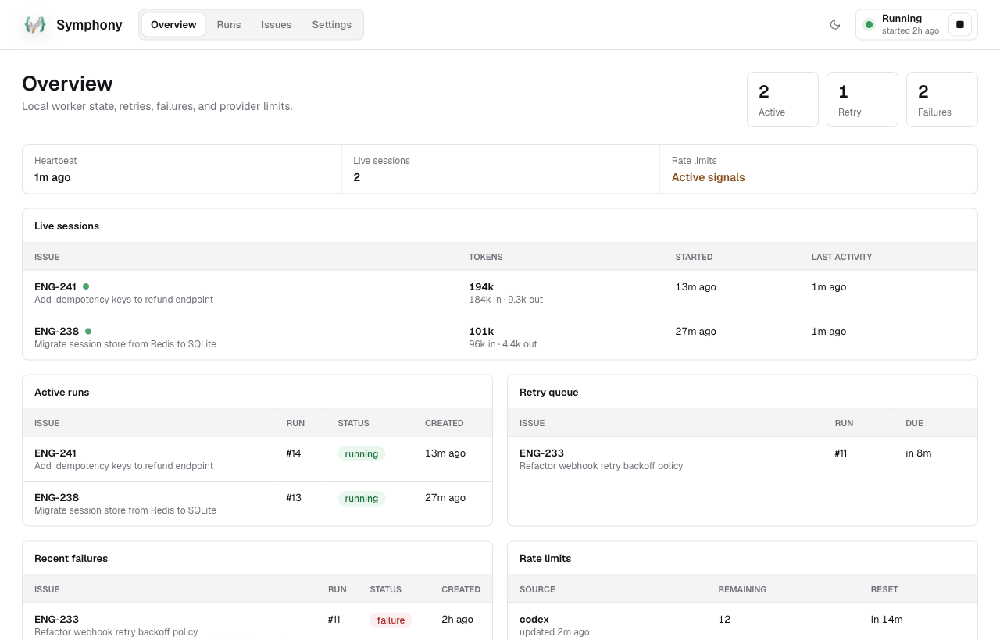

# Symphony

**An autonomous engineering team for your Linear project.** Symphony is a desktop app that watches your Linear board and dispatches coding agents — [Codex](https://github.com/openai/codex), [Claude Code](https://claude.com/claude-code), [Cursor](https://cursor.com/docs/cli/overview), or [opencode](https://opencode.ai) — to work on issues, each in its own freshly cloned workspace. You triage and review; Symphony orchestrates. Based on the [spec](https://github.com/openai/symphony/blob/main/SPEC.md) from OpenAI.

**[⬇ Download for macOS](https://github.com/anantjain-xyz/symphony-rust/releases/latest/download/Symphony.dmg)** (Apple Silicon) · [](https://github.com/anantjain-xyz/symphony-rust/releases/latest)

<picture>
  <source media="(prefers-color-scheme: dark)" srcset="docs/overview-dark.png">
  
</picture>

## How it works

1. **Poll** — a local worker polls Linear for issues in the states you mark as active (e.g. `Todo`, `In Progress`, `Rework`).
2. **Prepare** — for each issue, Symphony creates an isolated workspace and runs your `after_create` hook (typically `git clone` + dependency install).
3. **Dispatch** — it renders your prompt template with the issue's identifier, title, state, and description, then drives a Codex, Claude Code, Cursor, or opencode agent session natively over their structured event streams.
4. **Track** — agent events, token counts, retries, failures, and provider rate-limit signals are recorded in a local SQLite database and streamed live to the dashboard.
5. **Retry** — failed runs are retried with exponential backoff, and the retry prompt includes the previous run's error context.

Everything runs on your machine. The only network calls are to Linear's API and whatever your agents and hooks do.

## Requirements

- **macOS** (primary target; Tauri builds for other platforms are untested)
- A [Linear](https://linear.app) workspace and a [personal API key](https://linear.app/settings/account/security)
- At least one agent CLI installed and authenticated:
  - `codex` — OpenAI Codex CLI
  - `claude` — Claude Code CLI
  - `agent` — Cursor Agent CLI (`cursor-agent` also works)
  - `opencode` — opencode CLI
- `git`, plus whatever your repository's install step needs

## Getting started

**[Download Symphony.dmg](https://github.com/anantjain-xyz/symphony-rust/releases/latest/download/Symphony.dmg)** — the latest signed and notarized build for macOS (Apple Silicon). Open it, drag **Symphony** to Applications, and launch.

Or build and run from source:

```sh
git clone https://github.com/anantjain-xyz/symphony-rust.git
cd symphony-rust
pnpm install
pnpm tauri dev      # or: pnpm tauri build
```

See [Building](#building) for production bundles and signed releases.

On first launch the Overview shows a setup checklist:

1. **Connect Linear** — paste your API key in *Settings → Linear*. It is stored in the macOS keychain, never on disk.
2. **Add your repositories** — one or more Git URLs; each run clones the repo its issue routes to.
3. **Start the worker** — the ▶ button in the top bar. Symphony begins polling and dispatching.

Optional Linear filters (workspace slug, project URL or ID, identifier prefix like `ENG`) narrow which issues Symphony picks up. Use **Validate** in Settings to check your configuration and confirm the agent CLIs are discoverable before starting.

## Settings and the prompt template

Symphony's behavior is configured entirely in *Settings* — no config file to edit:

- **Repositories** — the Git repos runs clone, each with its own install command, plus where per-run workspaces are created (one folder per repo, then per issue). Every issue routes to exactly one repo, first match wins: a `repo:<name>` label or bare `<name>` label on the issue in Linear, then the repo claiming the issue's Linear project, then the repo claiming its team key (e.g. `ENG`), then the repo marked *default*. The default is optional; without a matching label, project rule, team rule, or default, the issue is skipped. An issue whose `repo:` label matches no configured repo is skipped — an explicit label is never silently rerouted. Every run records the repo it was dispatched to; with several repos configured the dashboard tags runs with it and the Runs view can filter by repo.
- **Linear** — API key (keychain), optional workspace/project/team filters, and the workflow states that drive dispatch: issues in an *active state* (e.g. `Todo`, `In Progress`, `Rework`, `Merging`) get an agent; issues in a *terminal state* (e.g. `Done`, `Canceled`) are left alone.
- **Agent** — which CLI runs issues (`codex`, `claude`, `cursor`, or `opencode`), an optional launch command (wrappers with arguments like `mycode --agent claude` are fine; Symphony appends its own flags), the per-turn timeout, custom session environment variables (e.g. `CURSOR_API_KEY` for Cursor), and the backend's options: approval policy, thread sandbox, and network access for Codex; permission mode and allowed/disallowed tool rules for Claude Code; mode, force/trust, sandbox, and optional model for Cursor; optional model and agent plus a skip-permissions toggle for opencode (on by default — opencode auto-rejects every tool call in non-interactive mode without it).
- **Worker** — polling interval, max concurrent agents, retry backoff cap, and the lifecycle hooks (under *Hooks (advanced)*): `after_create`, `before_run`, `after_run`, `before_remove`. Hooks are shell scripts that run in the workspace with `$REPO_URL`, `$REPO_NAME`, `$ISSUE_ID`, `$ISSUE_IDENTIFIER`, `$ISSUE_TITLE`, `$ISSUE_STATE`, `$ISSUE_BRANCH`, `$RUN_NUMBER`, `$SYMPHONY_INSTALL_CMD`, and `$SYMPHONY_HOOK` in their environment; the repo variables reflect the repo the issue routed to.

The **prompt template** at the bottom of Settings is the instruction document sent to the agent for each issue. Placeholders in `{{...}}` form are rendered from the Linear issue when a run starts; the reference panel next to the editor lists them and inserts one at the cursor on click:

| Placeholder | Renders as |
|---|---|
| `{{issue.id}}` | Internal Linear ID |
| `{{issue.identifier}}` | Issue key, e.g. `SYM-42` |
| `{{issue.title}}` | Issue title |
| `{{issue.description}}` | Full issue body (empty if none) |
| `{{issue.state}}` | Current Linear state |
| `{{issue.branch}}` | Git branch from Linear (may be empty) |
| `{{issue.labels}}` | Labels, comma-separated |
| `{{issue.blockers}}` | Blocking issue identifiers, one `- <id>` bullet per line |
| `{{repo.name}}` | Name of the repo the issue routed to |
| `{{repo.url}}` | Git URL of the routed repo |

Retried runs automatically get a `## Retry context` section appended with the prior run's error and recent events.

## Data and security

- Your Linear API key lives in the **OS keychain**, not in a file.
- Custom session environment variables are saved in `settings.json` and injected into agent sessions alongside Symphony's runtime variables like `$LINEAR_API_KEY`, `$REPO_URL`, and `$REPO_NAME`.
- Runs, issues, and agent events are stored in a local **SQLite** database under the app data directory (`~/Library/Application Support/xyz.anantjain.symphony` on macOS), alongside daily-rotated logs and per-run workspaces.
- Agents run with the sandbox/permission settings you give them under *Settings → Agent*. The defaults (`approval_policy: never`, `permission_mode: auto`, network access on for Codex, `force` + `trust` on for Cursor) are tuned for unattended runs in disposable workspaces — review them before pointing Symphony at anything sensitive.

## Architecture

- `src-tauri/` — Tauri desktop shell, commands, keychain-backed settings, event forwarding
- `src/` — React dashboard (Overview, Runs, Issues, Settings)
- `crates/symphony-core` — domain types, workflow config, prompt rendering
- `crates/symphony-storage` — SQLite schema, repository, broadcast event bus
- `crates/symphony-tracker` — Linear GraphQL client and issue normalization
- `crates/symphony-agents` — native Codex, Claude, Cursor, and opencode process drivers
- `crates/symphony-worker` — recovery, polling loop, retries, hooks, workspace lifecycle

## Building

Prerequisites: **Rust** (stable), **Node.js** ≥ 20 with **pnpm**, and on macOS the Xcode Command Line Tools (`xcode-select --install`).

```sh
pnpm install
pnpm tauri dev            # run the app with hot reload
pnpm tauri build          # production bundle: .app + .dmg
pnpm typecheck && pnpm test && cargo test --workspace   # the checks CI runs
```

`pnpm tauri build` writes artifacts to `target/release/bundle/` (`macos/Symphony.app`, `dmg/*.dmg`); pass `--debug` for a faster unoptimized bundle. On macOS the `pnpm tauri` wrapper sets `CI=true` during builds so DMG creation uses Tauri's deterministic path instead of Finder AppleScript window decoration, which can time out in non-interactive shells (set `TAURI_BUNDLER_DMG_IGNORE_CI=true` to opt out).

### Signed macOS release

```sh
pnpm release:mac
```

This builds, signs, notarizes, and staples the distributable DMG, then verifies the result with `spctl` and `stapler validate`. Signing and notarization credentials live in `~/.symphony-release.env` (override the location with `SYMPHONY_RELEASE_ENV`):

```sh
APPLE_SIGNING_IDENTITY=... # e.g. "Developer ID Application: Jane Doe (TEAMID1234)"
APPLE_API_ISSUER=...       # App Store Connect issuer ID (UUID)
APPLE_API_KEY=...          # API key ID
APPLE_API_KEY_PATH=...     # absolute path to the AuthKey_<id>.p8 file
```

The Developer ID Application certificate named by `APPLE_SIGNING_IDENTITY` must be installed in the login keychain; the script validates it before building.

The finished DMG lands in `target/release/bundle/dmg/`.

### Publishing a release

```sh
pnpm release:publish
```

This runs the signed build above, then tags `v<version>` (read from `src-tauri/tauri.conf.json`) and creates a GitHub release with the DMG attached under both its versioned name and the stable name `Symphony.dmg` — the file behind the download link at the top of this README, which always serves the newest release. Bump the version in `src-tauri/tauri.conf.json` (and keep `package.json` in sync) before publishing.

The script refuses to run unless you're on a clean `main` checkout matching `origin/main`, and it needs an authenticated [GitHub CLI](https://cli.github.com) (`gh`) with push access.

See [CONTRIBUTING.md](CONTRIBUTING.md) for the full contributor guide, including TypeScript bindings regeneration.

## License

[MIT](LICENSE)
